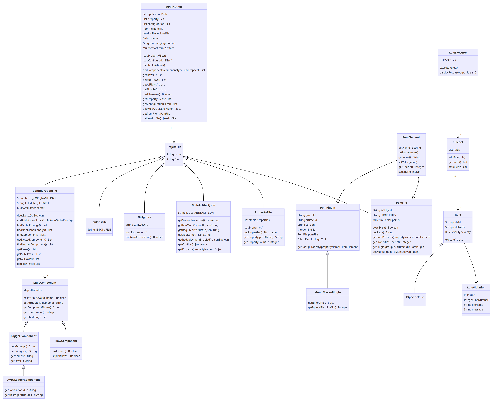

#Mule Linter Tool
A linter is a tool that analyzes source code looking for patterns that don’t follow convention.  Linting helps prevent errors and improve the overall quality of the code by following best practices.  Lint tools are a form of static code analyzers.  Some common code analyzers for Java are Checkstyle, FindBugs, and PMD.

The Mule Linter will enforce that all Mule projects are developed with a baseline set of rules.  Some basic examples of rules that will be enforced, are the proper usage of property and pom files, useful logging messages, and standard project structure.

## Execution

The mule-linter can be run as a jar with the following command: 

```
~/code/avio/mule-linter$ java -jar mule-linter-1.0-SNAPSHOT.jar --dir=SampleMuleApp --rules='AVIOCustomRuleConfiguration.groovy'
```

`--dir` is the root directory of the Mule project. `--rules` is the path to the rule configuration file. 

## Rule Configuration

Create a Groovy class that implements a static method called `getRules` and returns a RuleSet object. 

```groovy
static RuleSet getRules() { }
```

Initialize the Rules you would like to use, and add them to the RuleSet with the `.addRule(Rule)` method. 
Make sure to import the rules and helper classes you intend to use. 

Sample configuration:
```groovy
import com.avioconsulting.mule.linter.model.rule.RuleSet
import com.avioconsulting.mule.linter.model.CaseNaming
import com.avioconsulting.mule.linter.rule.cicd.*
import com.avioconsulting.mule.linter.rule.configuration.*
import com.avioconsulting.mule.linter.rule.git.*
import com.avioconsulting.mule.linter.rule.muleartifact.*
import com.avioconsulting.mule.linter.rule.pom.*
import com.avioconsulting.mule.linter.rule.property.*

class AVIOCustomRuleConfiguration {
	static final List<String> ENVIRONMENTS = ['dev','test','prod']
	static final String GLOBALS_FILENAME = 'globals.xml'

	static RuleSet getRules() {
		RuleSet rules = new RuleSet()

		//cicd
		rules.addRule(new JenkinsFileExistsRule())

		//configuration
		rules.addRule(new ConfigFileNamingRule(CaseNaming.CaseFormat.KEBAB_CASE))
		rules.addRule(new FlowSubflowNamingRule(CaseNaming.CaseFormat.KEBAB_CASE))
		rules.addRule(new GlobalConfigNoFlowsRule(GLOBALS_FILENAME))
		rules.addRule(new GlobalConfigRule(GLOBALS_FILENAME))
		rules.addRule(new LoggerCategoryExistsRule())
		rules.addRule(new LoggerMessageExistsRule())
		rules.addRule(new OnErrorLogExceptionRule())
		rules.addRule(new UnusedFlowRule())

		//git
		rules.addRule(new GitIgnoreRule())

		//muleArtifact
		rules.addRule(new MuleArtifactHasSecurePropertiesRule())
		rules.addRule(new MuleArtifactMinMuleVersionRule())

		//pom
		rules.addRule(new MuleMavenPluginVersionRule('3.3.5'))
		rules.addRule(new MuleRuntimeVersionRule('4.2.1'))
		rules.addRule(new MunitMavenPluginAttributesRule())
		rules.addRule(new MunitVersionRule('2.2.1'))
		rules.addRule(new PomExistsRule())

		//property
		rules.addRule(new EncryptedPasswordRule())
		rules.addRule(new PropertyExistsRule('db.user', ENVIRONMENTS))
		rules.addRule(new PropertyFileNamingRule(ENVIRONMENTS))
		rules.addRule(new PropertyFilePropertyCountRule(ENVIRONMENTS))

		return rules
	}

}
```
For a full breakdown on the available rules, [check here](docs/available_rules.md).

## Maven Plugin
The mule linter can be run as mvn plugin

The Maven Plugin is located in the *mavenPlugin* folder. Install it with the following command:

```mvn install```

This is an example of how to use the maven plugin by command line
```mvn com.avioconsulting.mule.maven:mule-linter-maven-plugin:0.0.1-SNAPSHOT:mule-linter -DappDir=<<Path to the Mule project>> -DruleConfiguration=<<Path to groovy rules file>> -Dformats=console,html,json```

Reports from JSON and HTML format will be saved in the *target/site* directory  


## Code Checkout
When cloning add the 'recurse-submodules' flag

```git clone --recurse-submodules```

After cloning, update the submodules

```git submodule update --remote```

## Mule Application Design


### Updating Mermaid Diagram
[Mermaid Live Editor](https://mermaid-js.github.io/mermaid-live-editor/#/edit/eyJjb2RlIjoiY2xhc3NEaWFncmFtXG5cdGNsYXNzIEFwcGxpY2F0aW9ue1xuICAgICAgICBGaWxlIGFwcGxpY2F0aW9uUGF0aFxuICAgICAgICBMaXN0PFByb3BlcnR5RmlsZT4gcHJvcGVydHlGaWxlc1xuICAgICAgICBMaXN0PENvbmZpZ3VyYXRpb25GaWxlPiBjb25maWd1cmF0aW9uRmlsZXNcbiAgICAgICAgUG9tRmlsZSBwb21GaWxlXG4gICAgICAgIEplbmtpbnNGaWxlIGplbmtpbnNGaWxlXG4gICAgICAgIFN0cmluZyBuYW1lXG4gICAgICAgIEdpdElnbm9yZUZpbGUgZ2l0aWdub3JlRmlsZVxuICAgICAgICBNdWxlQXJ0aWZhY3QgbXVsZUFydGlmYWN0XG4gICAgICAgIGxvYWRQcm9wZXJ0eUZpbGVzKClcbiAgICAgICAgbG9hZENvbmZpZ3VyYXRpb25GaWxlcygpXG4gICAgICAgIGxvYWRNdWxlQXJ0aWZhY3QoKVxuICAgICAgICBmaW5kQ29tcG9uZW50cyhjb21wbmVudFR5cGUsIG5hbWVzcGFjZSkgTGlzdDxNdWxlQ29tcG9uZW50PlxuICAgICAgICBnZXRGbG93cygpIExpc3Q8Rmxvd0NvbXBvbmVudD5cbiAgICAgICAgZ2V0U3ViRmxvd3MoKSBMaXN0PEZsb3dDb21wb25lbnQ-XG4gICAgICAgIGdldEFsbEZsb3dzKCkgTGlzdDxGbG93Q29tcG9uZW50PlxuICAgICAgICBnZXRGbG93UmVmcygpIExpc3Q8TXVsZUNvbXBvbmVudD5cbiAgICAgICAgaGFzRmlsZShuYW1lKSBCb29sZWFuXG4gICAgICAgIGdldFByb3BlcnR5RmlsZXMoKSBMaXN0PFByb3BlcnR5RmlsZT5cbiAgICAgICAgZ2V0Q29uZmlndXJhdGlvbkZpbGVzKCkgTGlzdDxDb25maWd1cmF0aW9uRmlsZT4gXG4gICAgICAgIGdldE11bGVBcnRpZmFjdCgpIE11bGVBcnRpZmFjdFxuICAgICAgICBnZXRQb21GaWxlKCkgUG9tRmlsZVxuICAgICAgICBnZXRKZW5raW5zZmlsZSgpIEplbmtpbnNGaWxlXG4gICAgICAgIFxuICAgIH1cbiAgICBBcHBsaWNhdGlvbiBcIjFcIiAtLT4gXCIqXCIgUHJvamVjdEZpbGVcbiAgICBjbGFzcyBQcm9qZWN0RmlsZXtcbiAgICAgICAgU3RyaW5nIG5hbWVcbiAgICAgICAgU3RyaW5nIEZpbGUgXG4gICAgfVxuICAgIFByb2plY3RGaWxlIDx8LS0gUG9tRmlsZVxuICAgIGNsYXNzIFBvbUZpbGUge1xuXHRcdFN0cmluZyBQT01fWE1MXG5cdFx0U3RyaW5nIFBST1BFUlRJRVNcblx0XHRNdWxlWG1sUGFyc2VyIHBhcnNlclxuXHRcdGRvZXNFeGlzdCgpIEJvb2xlYW5cblx0XHRnZXRQYXRoKCkgU3RyaW5nXG5cdFx0Z2V0UG9tUHJvcGVydHkocHJvcGVydHlOYW1lKSBQb21FbGVtZW50XG5cdFx0Z2V0UHJvcGVydGllc0xpbmVObygpIEludGVnZXJcblx0XHRnZXRQbHVnaW4oZ3JvdXBJZCwgYXJ0aWZhY3RJZCkgUG9tUGx1Z2luXG5cdFx0Z2V0TXVuaXRQbHVnaW4oKSBNdW5pdE1hdmVuUGx1Z2luXG4gICAgfVxuICAgIFByb2plY3RGaWxlIDx8LS0gUHJvcGVydHlGaWxlXG4gICAgY2xhc3MgUHJvcGVydHlGaWxlIHtcbiAgICAgICAgUHJvcGVydGllcyBwcm9wZXJ0aWVzXG4gICAgICAgIGxvYWRQcm9wZXJ0aWVzKClcbiAgICAgICAgZ2V0UHJvcGVydHkocHJvcE5hbWUpIFN0cmluZ1xuICAgICAgICBnZXRQcm9wZXJ0eUNvdW50KCkgSW50ZWdlclxuICAgIH1cbiAgICBQcm9qZWN0RmlsZSA8fC0tIE11bGVBcnRpZmFjdEpzb25cbiAgICBjbGFzcyBNdWxlQXJ0aWZhY3RKc29uIHtcblx0XHRTdHJpbmcgTVVMRV9BUlRJRkFDVF9KU09OXG5cdFx0Z2V0U2VjdXJlUHJvcGVydGllcygpIEpzb25BcnJheVxuXHRcdGdldE1pbk11bGVWZXJzaW9uKCkgSnNvblN0cmluZ1xuXHRcdGdldFJlcXVpcmVkUHJvZHVjdCgpIEpzb25TdHJpbmdcblx0XHRnZXRBcHBOYW1lKCkgSnNvblN0cmluZ1xuXHRcdGdldFJlZGVwbG95bWVudEVuYWJsZWQoKSBKc29uQm9vbGVhblxuXHRcdGdldENvbmZpZ3MoKSBKc29uQXJyYXlcblx0XHRnZXRQcm9wZXJ0eShwcm9wZXJ0eU5hbWUpIE9iamVjdFxuICAgIH1cbiAgICBQcm9qZWN0RmlsZSA8fC0tIEdpdElnbm9yZVxuICAgIGNsYXNzIEdpdElnbm9yZSB7XG5cdFx0U3RyaW5nIEdJVElHTk9SRVxuXHRcdGxvYWRFeHByZXNzaW9ucygpXG4gICAgICAgIGNvbnRhaW5zKGV4cHJlc3Npb24pIEJvb2xlYW5cbiAgICB9XG4gICAgUHJvamVjdEZpbGUgPHwtLSBKZW5raW5zRmlsZVxuICAgIGNsYXNzIEplbmtpbnNGaWxlIHtcblx0XHRTdHJpbmcgSkVOS0lOU0ZJTEVcblx0fVxuXG4gICAgUHJvamVjdEZpbGUgPHwtLSBDb25maWd1cmF0aW9uRmlsZVxuICAgIGNsYXNzIENvbmZpZ3VyYXRpb25GaWxle1xuXHRcdFN0cmluZyBNVUxFX0NPUkVfTkFNRVNQQUNFXG5cdFx0U3RyaW5nIEVMRU1FTlRfRkxPV1JFRlxuXHRcdE11bGVYbWxQYXJzZXIgcGFyc2VyXG5cdFx0ZG9lc0V4aXN0cygpIEJvb2xlYW5cblx0XHRhZGRBZGRpdGlvbmFsR2xvYmFsQ29uZmlnKG5vbkdsb2JhbENvbmZpZylcblx0XHRmaW5kR2xvYmFsQ29uZmlncygpIExpc3Q8TXVsZUNvbXBvbmVudD5cblx0XHRmaW5kTm9uR2xvYmFsQ29uZmlncygpIExpc3Q8TXVsZUNvbXBvbmVudD5cblx0XHRmaW5kQ29tcG9uZW50cygpIExpc3Q8TXVsZUNvbXBvbmVudD5cblx0XHRnZXROZXN0ZWRDb21wb25lbnQoKSBMaXN0PE11bGVDb21wb25lbnQ-XG5cdFx0ZmluZExvZ2dlckNvbXBvbmVudCgpIExpc3Q8TG9nZ2VyQ29tcG9uZW50PlxuICAgICAgICBnZXRGbG93cygpIExpc3Q8Rmxvd0NvbXBvbmVudD5cbiAgICAgICAgZ2V0U3ViRmxvd3MoKSBMaXN0PEZsb3dDb21wb25lbnQ-XG4gICAgICAgIGdldEFsbEZsb3dzKCkgTGlzdDxGbG93Q29tcG9uZW50PlxuICAgICAgICBnZXRGbG93UmVmcygpIExpc3Q8TXVsZUNvbXBvbmVudD5cbiAgICB9XG5cbiAgICBDb25maWd1cmF0aW9uRmlsZSBcIjFcIiAtLT4gXCIqXCIgTXVsZUNvbXBvbmVudFxuICAgIGNsYXNzIE11bGVDb21wb25lbnR7XG4gICAgICAgIE1hcDxTdHJpbmcsIFN0cmluZz4gYXR0cmlidXRlc1xuICAgICAgICBoYXNBdHRyaWJ1dGVWYWx1ZShuYW1lKSBCb29sZWFuXG4gICAgICAgIGdldEF0dHJpYnV0ZVZhbHVlKG5hbWUpIFN0cmluZ1xuICAgICAgICBnZXRDb21wb25lbnROYW1lKCkgU3RyaW5nXG4gICAgICAgIGdldExpbmVOdW1iZXIoKSBJbnRlZ2VyXG4gICAgICAgIGdldENoaWxkcmVuKCkgTGlzdDxNdWxlQ29tcG9uZW50PlxuICAgIH1cbiAgICBNdWxlQ29tcG9uZW50IDx8LS0gRmxvd0NvbXBvbmVudFxuICAgIGNsYXNzIEZsb3dDb21wb25lbnR7XG5cdFx0aGFzTGlzdG5lcigpIEJvb2xlYW5cblx0XHRpc0FwaUtpdEZsb3coKSBCb29sZWFuICAgICAgICBcbiAgICB9XG4gICAgTXVsZUNvbXBvbmVudCA8fC0tIExvZ2dlckNvbXBvbmVudFxuICAgIGNsYXNzIExvZ2dlckNvbXBvbmVudHtcbiAgICAgICAgZ2V0TWVzc2FnZSgpIFN0cmluZ1xuICAgICAgICBnZXRDYXRlZ29yeSgpIFN0cmluZ1xuICAgICAgICBnZXROYW1lKCkgU3RyaW5nXG4gICAgICAgIGdldExldmVsKCkgU3RyaW5nXG4gICAgfVxuICAgIFBvbVBsdWdpbiA8fC0tIE11bml0TWF2ZW5QbHVnaW5cbiAgICBjbGFzcyBNdW5pdE1hdmVuUGx1Z2luIHtcblx0XHRnZXRJZ25vcmVGaWxlcygpIExpc3Q8U3RyaW5nPlxuXHRcdGdldElnbm9yZUZpbGVzTGluZU5vKCkgSW50ZWdlclxuICAgIH1cblx0Y2xhc3MgUG9tUGx1Z2luIHtcblx0XHRTdHJpbmcgZ3JvdXBJZFxuXHRcdFN0cmluZyBhcnRpZmFjdElkXG5cdFx0U3RyaW5nIHZlcnNpb25cblx0XHRJbnRlZ2VyIGxpbmVOb1xuXHRcdFBvbUZpbGUgcG9tRmlsZVxuXHRcdEdQYXRoUmVzdWx0IHBsdWdpblhtbFxuXHRcdGdldENvbmZpZ1Byb3BlcnR5KHByb3BlcnR5TmFtZSkgUG9tRWxlbWVudFxuXHRcdFxuXHR9XG5cdFBvbUVsZW1lbnQgLS0-IFBvbUZpbGVcbiAgICBQb21FbGVtZW50IC0tPiBQb21QbHVnaW5cblx0Y2xhc3MgUG9tRWxlbWVudCB7XG5cdFx0Z2V0TmFtZSgpIFN0cmluZ1xuXHRcdHNldE5hbWUobmFtZSlcblx0XHRnZXRWYWx1ZSgpIFN0cmluZ1xuXHRcdHNldFZhbHVlKHZhbHVlKVxuXHRcdGdldExpbmVObygpIEludGVnZXJcblx0XHRzZXRMaW5lTm8obGluZU5vKVxuXHR9XG4gICAgXG4gICAgXG4gICAgXG4gICAgY2xhc3MgUnVsZUV4ZWN1dGVyIHtcbiAgICAgICAgUnVsZVNldCBydWxlc1xuICAgICAgICBleGVjdXRlUnVsZXMoKVxuICAgICAgICBkaXNwbGF5UmVzdWx0cyhvdXRwdXRTdHJlYW0pXG4gICAgfVxuICAgIFxuICAgIFJ1bGVFeGVjdXRlciBcIjFcIiAtLT4gXCIxXCIgUnVsZVNldFxuICAgIGNsYXNzIFJ1bGVTZXQge1xuXHRcdExpc3Q8UnVsZT4gcnVsZXNcblx0XHRhZGRSdWxlKHJ1bGUpXG5cdFx0Z2V0UnVsZXMoKSBMaXN0PFJ1bGU-XG5cdFx0c2V0UnVsZXMocnVsZXMpXG4gICAgfVxuICAgIFJ1bGVTZXQgXCIwXCIgLS0-IFwiKlwiIFJ1bGVcbiAgICBjbGFzcyBSdWxle1xuICAgICAgICBTdHJpbmcgcnVsZUlkXG4gICAgICAgIFN0cmluZyBydWxlTmFtZVxuICAgICAgICBSdWxlU2V2ZXJpdHkgc2V2ZXJpdHlcbiAgICAgICAgZXhlY3V0ZSgpIExpc3Q8UnVsZVZpb2xhdGlvbj5cbiAgICB9XG4gICAgUnVsZSAtLT4gUnVsZVZpb2xhdGlvblxuICAgIGNsYXNzIFJ1bGVWaW9sYXRpb257XG4gICAgICAgIFJ1bGUgcnVsZVxuICAgICAgICBJbnRlZ2VyIGxpbmVOdW1iZXJcbiAgICAgICAgU3RyaW5nIGZpbGVOYW1lXG4gICAgICAgIFN0cmluZyBtZXNzYWdlXG4gICAgfVxuICAgIFJ1bGUgPHwtLSBBU3BlY2lmaWNSdWxlXG4gICAgY2xhc3MgQVNwZWNpZmljUnVsZSB7XG5cbiAgICB9XG4iLCJtZXJtYWlkIjp7InRoZW1lIjoiZGVmYXVsdCJ9LCJ1cGRhdGVFZGl0b3IiOmZhbHNlfQ)
* Update code in [mule-application-design.mmd](config/mermaid/mule-application-design.mmd) and paste into live editor
* Click 'Download PNG' and save file into [config/mermaid](config/mermaid) directory
## Code Coverage
[CodeNarc](https://codenarc.github.io/CodeNarc/) is used to ensure quality in groovy code.  The configuration file is located [here.](config/code-quality-config/codenarc/codenarc.xml)  To execute run ```gradle check```, and an output [report](build/reports/codenarc/main.html) will be generated. 