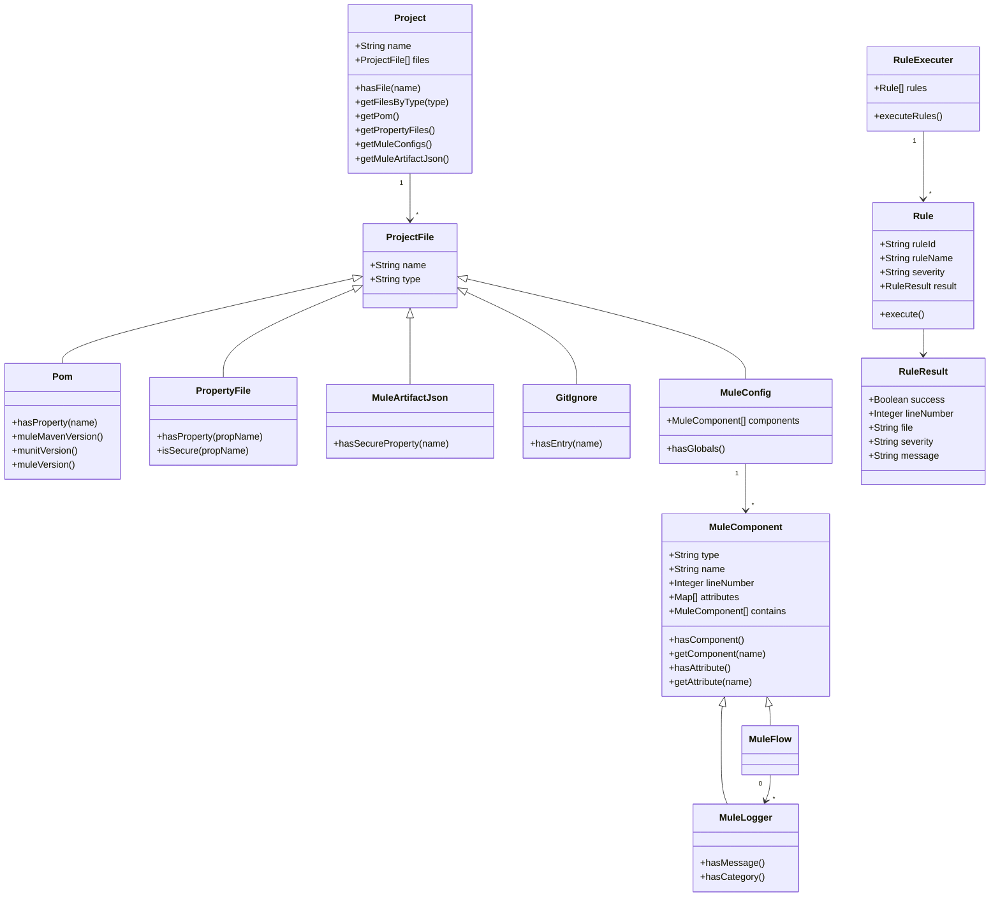

# mule-linter
Mule Linter Tool

```mermaid
classDiagram
	class Project{
        +String name
        +ProjectFile[] files
        +hasFile(name)
        +getFilesByType(type)
        +getPom()
        +getPropertyFiles()
        +getMuleConfigs()
        +getMuleArtifactJson()
    }
    Project "1" --> "*" ProjectFile
    class ProjectFile{
        +String name
        +String type 
    }
    ProjectFile <|-- Pom
    class Pom {
        +hasProperty(name)
        +muleMavenVersion()
        +munitVersion()
        +muleVersion()
    }
    ProjectFile <|-- PropertyFile
    class PropertyFile {
        +hasProperty(propName)
        +isSecure(propName)
    }
    ProjectFile <|-- MuleArtifactJson
    class MuleArtifactJson {
        +hasSecureProperty(name)
    }
    ProjectFile <|-- GitIgnore
    class GitIgnore {
        +hasEntry(name)
    }

    ProjectFile <|-- MuleConfig
    class MuleConfig{
        +MuleComponent[] components
        +hasGlobals()
    }

    MuleConfig "1" --> "*" MuleComponent
    class MuleComponent{
        +String type
        +String name
        +Integer lineNumber
        +Map[] attributes
        +MuleComponent[] contains
        +hasComponent()
        +getComponent(name)
        +hasAttribute()
        +getAttribute(name)
    }
    MuleComponent <|-- MuleFlow
    class MuleFlow{
        
    }
    MuleComponent <|-- MuleLogger
    class MuleLogger{
        +hasMessage()
        +hasCategory()
    }
	MuleFlow "0" --> "*" MuleLogger
    class RuleExecuter {
        +Rule[] rules
        +executeRules()
    }
    RuleExecuter "1" --> "*" Rule
    class Rule{
        +String ruleId
        +String ruleName
        +String severity
        +RuleResult result
        +execute()
    }
    Rule --> RuleResult
    class RuleResult{
        +Boolean success
        +Integer lineNumber
        +String file
        +String severity
        +String message
    }

```
