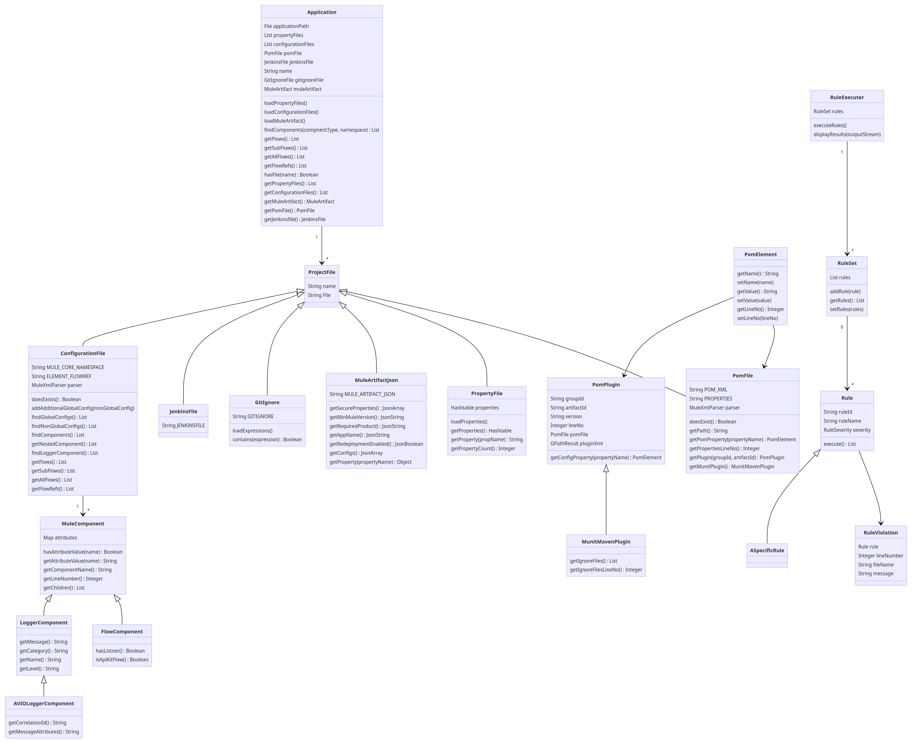

# Mule Linter Tool
A linter is a tool that analyzes source code looking for patterns that don’t follow convention.  Linting helps prevent errors and improve the overall quality of the code by following best practices.  Lint tools are a form of static code analyzers.  Some common code analyzers for Java are Checkstyle, FindBugs, and PMD.

The Mule Linter will enforce that all Mule projects are developed with a baseline set of rules.  Some basic examples of rules that will be enforced, are the proper usage of property and pom files, useful logging messages, and standard project structure.

## Usage

### Maven Plugin
See [Readme](mule-linter-maven-plugin/README.md) in `mule-linter-maven-plugin` module.

### CLI

Project uses Gradle build system. Run following command to build all components in local -

```shell
./gradlew build
```

The CLI distributions are generated in `./mule-linter-cli/build/distributions/`. 
Unzip/Untar the distribution. You can run the CLI from expanded files - 

```shell
./bin/mule-linter-cli
```

You may move expanded distribution folder to other persistent location and add it on OS PATH, 
and then run cli from anywhere on the system.

```shell
# Report only (default), including all severities
./bin/mule-linter-cli -d ./my-app -r ./muleLinter.groovy -f CONSOLE
# Fail on MAJOR, CRITICAL or BLOCKER findings
./bin/mule-linter-cli -d ./my-app -r ./muleLinter.groovy --fail --threshold MAJOR
```

`-d` / `--dir` and `-r` / `--rules` are required. `-f` / `--format` accepts
`CONSOLE` (default), `JSON` (existing SonarQube external-issues format), or `XML`.
`--fail` enables findings enforcement; `--threshold` defaults to `MAJOR` and uses
the explicit order `BLOCKER > CRITICAL > MAJOR > MINOR`. The threshold has no
effect on which findings are reported, and does not enable enforcement by itself.

Exit statuses: **0** = completed without an enforced findings failure,
**1** = enforced findings failure, **2** = invalid input/configuration, rule
execution error, or requested report write failure. Operational errors fail even
in report-only mode.

Unresolved parent POMs are separate analysis warnings, not violations, and mark
analysis incomplete. By default analysis continues; use **`--strict`** to treat
incomplete analysis as an operational error (status 2). Console reports include
warnings; JSON/XML keep their existing schemas and warnings go to stderr.

The core executes once and exposes an immutable `RuleExecutor.analysisResult`
with scalar finding metadata, warnings, and completeness. `ReportWriters` can
render independent reports in any order without changing findings. Existing
`buildLinterExecutor()`, `results`, and `displayResults()` remain compatibility
APIs; reports and failure policy use the snapshot, not mutable legacy results.

## Build

When cloning add the 'recurse-submodules' flag

```git clone --recurse-submodules```

After cloning, update the submodules

```git submodule update --remote```

To build the project run - 

`./gradlew build`

Generated Distribution and install in local - 

`./gradlew installDist`

## Release

To release this module, follow these steps - 
1. Create a new branch from `main` with naming convention - `release/x.y.z` eg. `release/1.1.0`
2. Run one of the following command -
* Release current snapshot - `./gradlew -Dversion.prerelease=`
* Release next minor non-snapshot - `./gradlew -Dversion.prerelease= incrementMinor`
3. Commit the modified `version.properties` modified by above command
4. Create PR to main
5. Once approved, JReleaser will release it to maven central


## Rule Configuration

Rule Configuration uses a Groovy-DSL provided by Mule Linter. See [AVIOGDSLRuleConfiguration.groovy](mule-linter-core/AVIOGDSLRuleConfiguration.groovy) for sample configuration.

### Rule catalog and agent commands

Every built-in rule has an explicit typed definition in
`mule-linter-core/src/main/groovy/com/avioconsulting/mule/linter/catalog/BuiltinRuleProvider.groovy`.
The catalog supplies descriptions, defaults, required options, nested types, allowed values,
and factories to configuration validation, IDE metadata, and these commands:

```shell
mule-linter rules list
mule-linter rules describe logger-required-attributes
mule-linter config validate muleLinter.groovy
```

Append `--json` to any of these commands for machine-readable output with `schemaVersion: 1`.
List output includes every installed rule's full contract; describe accepts canonical IDs
or aliases. Validation returns `valid`, `ruleCount`, and the configured rule identities
without loading a Mule application, resolving parents, or running checks. These commands
return `0` on success and `2` on invalid input, configuration, or output errors.

Canonical kebab-case IDs and optional aliases share one unique namespace. Existing uppercase
IDs are aliases and remain the IDs used in reports. Repeated instances of the same rule
remain supported. A readable configuration can now use:

```groovy
mule_linter {
    rules {
        rule('logger-required-attributes') {
            requiredAttributes = ['category', 'message']
        }
        rule('flow-subflow-component-count') {
            maxCount = 20
        }
    }
}
```

Existing `LOGGER_REQUIRED_ATTRIBUTES { ... }` configurations still work. Unknown options,
missing required options, invalid collection contents, and malformed nested objects fail
before application loading. Rule-specific `init()` validation also runs at this point.

**Security:** configuration remains executable Groovy. Validate only trusted files;
this command is not a sandbox. Ordinary script `println` diagnostics go to stderr,
but arbitrary script code can still perform I/O. YAML loading is not implemented.

Mule Linter Core is shipped with many rules. You can browse subpackages under `com.avioconsulting.mule.linter.rule` in https://avioconsulting.github.io/mule-linter/groovydoc/index.html.

Application loading parses `pom.xml` and resolves its parent chain using embedded Maven
Resolver and Maven settings/authentication. It does not generate `effective-pom.xml` or
require a Maven executable. Unresolved parents mark analysis incomplete; see `--strict`.

### Using IntelliJ Auto Completion
Mule Linter's core library contains the GDSL file to support autocompletion in IntelliJ. To use that feature, `com.avioconsulting.mule:mule-linter-core`  dependency must be added with `provided`  scope in the project. `provided` scope will avoid maven packaging core into project artifact but still allow IntelliJ to detect the GDSL script from classpath.

## Extending for Mule Linter

Mule Linter provides SPI mechanisms to add custom rules and components. See the SPI
[README](./mule-linter-spi/README.md) for typed rule definitions and provider registration.
An example is included in [mule-linter-spi-test](./mule-linter-spi-test).

## Mule Application Design


### Updating Mermaid Diagram
[Mermaid Live Editor](https://mermaid-js.github.io/mermaid-live-editor/edit#pako:eNrVWFtT6zYQ_isePyWdwCQcOECGYSalhoaT2ySUnulkhhGxEnRqS64lU9KU_17dLEuyE3gtD1ja_by72pvW2YUrEsOwH64SQOkvCGxykC7xksl9MMiyBK0AQwTvljjQf7cogQGoWDPAXiruCFF2NctJBnO2FdDrILN21EPeELxGmyKXkhR85ZOsd2Ykleoz9awY9xD_iTCVzB_VugIsWI7wJsAgtYh3iA03mORQvrdBDJldBRoXCRzkDK3BigWptakgCQGxfWbaarvM2jFrCFuLzVsjzN9OM4IhZrS14kuxethmsCNPQzOwgm3lTSHEgK8rIRvIbhPyN1eqcGKzB7conj8LHSTJZ6GCNYdrA91n6AuQYWuJg7WDnwlJIMCOJM_NDfnmwJscvy_znBfdeDhJ4NqjMpFDZn5Ocq5Oy7VC3NuJqXDv6mFVWrAMe8swODq65quf-Iof7gdcsUq2Kk6LvPsgzTWxkqC1WiKCq3-PjtwjaDW64naiLSyZFjWbjp--j0cubT6dRfOHYbRQZOGy72kyAzmFeZDJh-LEBNLojQehZcVYMIQ_eTfhZCWzopK0jHGrbCcTmSOcEyUw5WlUgRUAQTpCGE4IFzfEDG5K9QKSFBuEW5ucFNkw7gRAh3YYS4mKbdDjAqPyFZEKfDcGrxCXsIMutVLTC5-hB1YAfwX0hYHnBF5Nn4WkTqCepo0iux9ajQe5PcXxA7d6r9zG6pJOVg4uI9GAuiEFZrZ3DznCrqB7SrDtDJ_nZdv4t1H0NOCpdTu4eXi6X0wnJjQLuCpy6JxUCBjkOdhW8UNYaHiEOeUFpiFehs3hXwXKofBmXMiSbwDxMhVO2SchhllCtiIXIyxcHWugn-Oq9TTbuifNVbAOe9jcZrZrDdHz6d3wYXg3mc4jRRWJFL1lOaTCRU4m8fuYAd62WtDwvda8z6B7_yJWJtl3tWvUfTT5NpwsbocjadZ72SVrkmvN25ZfYzZk0w0_-dNkMI4Ws8FN5PCjUTSOJg9Pt6Pp7_Po9tPNjPrdDMTxII6RsAIkdwl5BokyrYUJtvdthRdXvU3ee1uW4Ikr5kO8NUccQPIknEDKYAX_SO6IbHj51-Ae-f82j5jsq-VT7Yp2Xvcbm2FYXX4MsiuVbh3dYK8DwPjiuWB2f-fz0KAkP4KkODQZNQIburexR7eyBoi8N4v0GeZ-dy9lvKAkziH-wH_l-GxYqnqdwNjuchi6arkLhAosbXHqC9FBhr4hGcxWc0tqUO5lpa3eY-3cgZC3PrDZ47AbwH1E8m0z94Cj4StMPJY23TNGGT94HE4PHKCBvfNin-cwkYk8jJtN0uc02USbzTNTUnm7Nw1FZRG4vLLpc2XV15cpRV0OTZD6OFfWKTPDqqtCt3Q95zm0auRzyK9qSFA0rSdIpGJFq32CCuKdGFvnkBYJCzJpAb8svPv-MwOsvvRYRZRdxpnL67xqXDVuKBGVq70kFFSqqbJVGKBqHzWkIr-K_xW2ecCmhqEc1zaX-dJJjDmvzuiNT3CM-9hKVEFfQBbkhfPxDxVUcJ0BJUY0S8BWuZ-2SMGyQoQTgrTttXJHo93FxUqr9S0Ulmg3ygQVtOvSNn3PC1pLkCrXaDOD6h3jHMWSEtpOUZXqlmHXuV8E3Ter_tEnBIpsbiBPnO9BpYZnOmLbgOpFzc-27Y-IqK5xXbNXmulgfEsNwwuxtKwiOcUmL5_aUcR39KTp0zZVTatunOqaiwyu0BqtfD86DBnkUkDYCVOYpwDFYT-Udi9D9sJrahn2-TKGa8CTbRku8TuHgoKRxRavwv4aJBR2wiKL-Y2gf1DzqBEfCUluiBnAfxDCQSwv-BZK7lj_LCceEhL2d-Fb2D_rHp-eX573ul_PT7_0Ts7OO-E27B-d9E6OLy965ydfu5e9i4svZ--d8B8ptHd8ctE9u-ien112Ty9Ov568_wfp9MoY)
* Update code in [mule-application-design.mmd](config/mermaid/mule-application-design.mmd) and paste into live editor
* Click 'Download PNG' and save file into [config/mermaid](config/mermaid) directory
## Code Coverage
[CodeNarc](https://codenarc.github.io/CodeNarc/) is used to ensure quality in groovy code.  The configuration file is located [here.](config/code-quality-config/codenarc/codenarc.xml)  To execute run ```gradle check```, and an output [report](build/reports/codenarc/main.html) will be generated. 
## Global Configuration Layout

See [Global Configuration Layout](GLOBAL-CONFIGURATION.md) for the
separate configuration and flow-placement rules, exact-path exceptions, and
migration from the legacy single-filename checks.

## Exception Logging In Try Scopes

`ON_ERROR_LOG_EXCEPTION {}` requires explicit `logException="true"` on
flow-level and named shared error-handler branches. By default it skips branches
whose inline `error-handler` is directly inside a core Mule `try` scope, including
nested Try scopes. XML namespaces and ownership determine the scope, not filenames
or display names. A named shared handler remains checked even when referenced by a Try.

To restore strict checking of all branches:

```groovy
ON_ERROR_LOG_EXCEPTION {
    includeTryScopes = true
}
```

Choose Try logging based on recovery and the outer handler's responsibility.
Avoid duplicate stack traces when propagating; a Try that consumes an unexpected
technical failure still needs useful safe diagnostics. The exemption does not
verify replacement logging or change runtime behavior.

### Named Handler Exceptions

```groovy
ON_ERROR_LOG_EXCEPTION {
    exceptions = [[
        file: 'global/global-error-handler.xml',
        handler: 'global-error-handler',
        errorTypes: ['APIKIT:BAD_REQUEST'],
        reason: 'Expected validation failure has a safe structured WARN event.'
    ]]
}
```

Paths are exact, relative to `src/main/mule`, using forward slashes. Only explicit
`logException="false"` branches directly within the named shared handler match.
One exception must cover all comma-separated types on a branch. `ANY`, wildcard
types and blank reasons are rejected. Unused exceptions are findings. Other
branches and handlers remain checked, including a shared handler used by Try.
Review replacement logging separately; suppression alone does not prove safety.

### Local Hostnames

`HOSTNAME_PROPERTY` skips exact basenames `local.properties` and `unit.properties`
by default. Set `fileExemptions = []` to check them too, or provide a replacement
list. Other environments remain checked. Existing property-name `exemptions`,
such as `https.host` for listener bind addresses, continue to apply.
